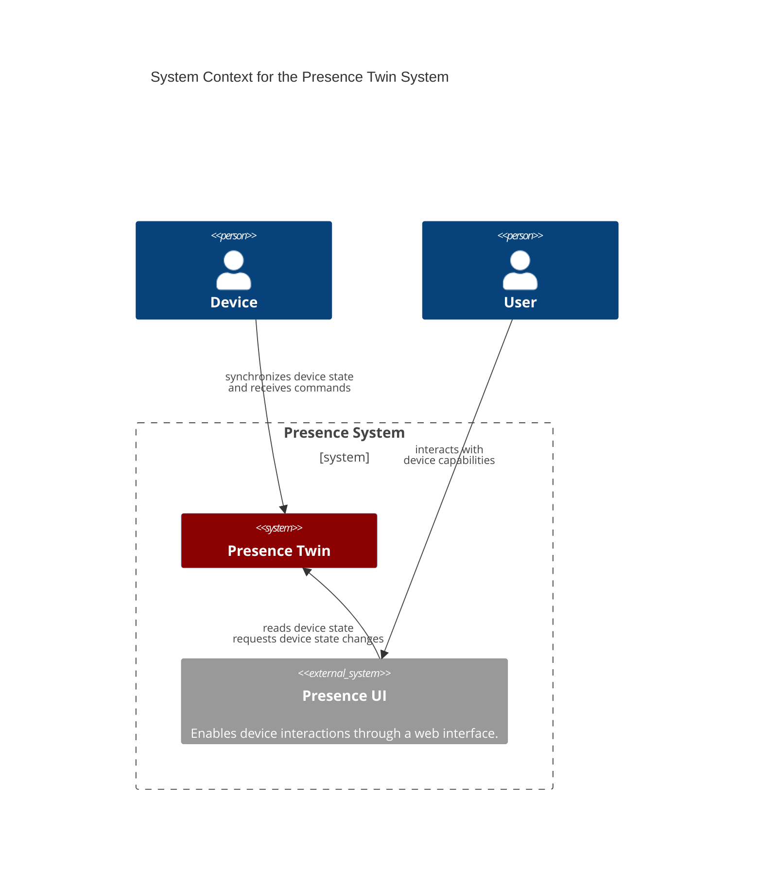
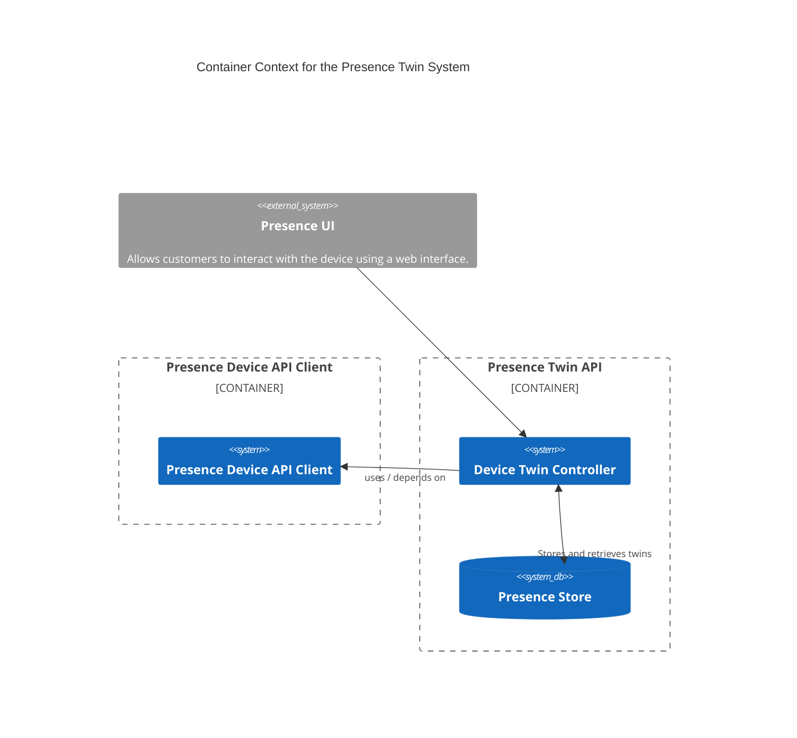
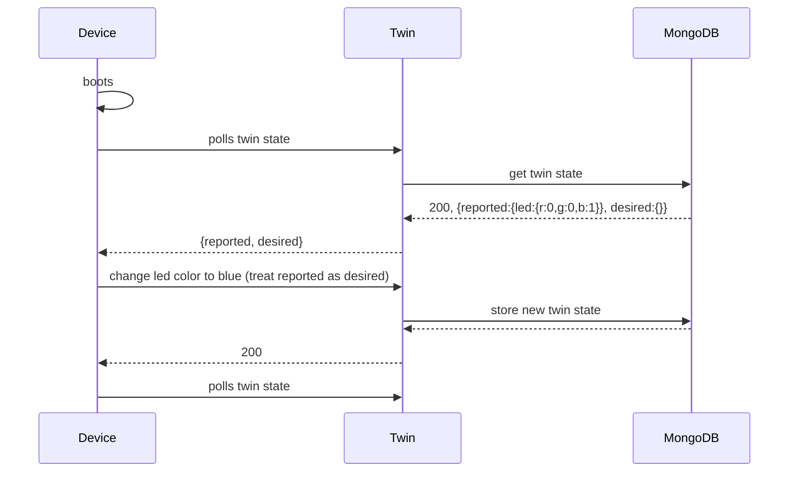

 Presence Twin

A web application that provides an API to

1. Device state updates
1. Store the state of the device as digital twin
1. Enable cloud applications to interact with the digital twin with the device


## Quickstart

```shell
# 1. build and run
dotnet run
# 2. the web browser opens automagically
# 3. browse to /swagger
```


## System Diagram



| Actor               | Description                                                                                              |
| ------------------- | -------------------------------------------------------------------------------------------------------- |
| **User**            | Owns a presence device and wants to interacts with it.                                                   |
| **Device**          | A physical presence device (i.e. Presence Cube) that a user can interact with.                           |
| **Presence System** | Handles communication between user and device / enables device interactions.                             |
| **Presence UI**     | Interface to the device. Visualizes device state and allows interactions (_set the light color to red_). |

## Container Diagram



| Actor              | Description                                                                                           |
| ------------------ | ----------------------------------------------------------------------------------------------------- |
| **User**           | Owns a presence device and interacts with it.                                                         |
| **Device**         | A physical presence device (i.e. Presence Cube) that a user can interact with.                        |
| **Presence UI*    | Web Interface for users to get updates from and interact with presence devices.                       |
| **Presence Twin**  | Digital cloud representation of a physical device. Also provides an interface for device interactLon. |
| **Presence Store** | Stores digital twin data.                                                                             |

### Actions

| Actor              | Target             | Action                            | Description                                                                                                                 |
| ----------------- | ------------------ | --------------------------------- | --------------------------------------------------------------------------------------------------------------------------- |
| **User**          | **Presence Ui**    | updates device properties         | The presence ui exposes visual elements to interact with the device via a web interface _ie. set the light color to purple_ |
| **Presence Ui**   | **Presence Twin**  | Polls reported state              | Periodically polls the digital twin for device state updates (_power is off_, _led turned green_)                           |
| **Presence Ui**   | **Presence Twin**  | Sets desired state                | Requests the digital twin to communicate the desired state changes to the device.                                           |
| **Presence Twin** | **Presence Store** | Stores and retrieves digital twin | -                                                                                                                           |

## Requirements

| As A            | I Want To                                                         | Because                                                                     |
| --------------- | ----------------------------------------------------------------- | --------------------------------------------------------------------------- |
| Presence Device | Poll the latest desired state changes                             | I need it to issue hardware commands so that the physical device state fits |
| Presence Device | Send reported state changes                                       | The cloud needs to know the current device state as soon as possible        |
| Presence Twin   | Store and retrieve the latest digital twin                        | To have a digital representation of the device properties                   |
| Developer       | Have a library for interacting with the Device Twin               | The library is being maintained by the embedded team                        |
| Developer       | Have tests failing if the library runs out of synch with our code |


## Digital Twin

A digital twin is an object that represents the device state as-is. We stick loosely to the Azure Device Twin spec:

* [Azure Digital Twin]

A typical payload would look like this

```json
{
  "deviceId": "3aca098a-f5b6-44d3-9162-49ad6f2ea83f",
  "sha1": "...",
  "version": 15,
  "properties": {
    "desired": {
      "sha1": "...",
      "led": {
        "id": "681ea14f-0f4a-4c1f-93c8-bb588907b58a",
        "r": 1.0,
        "g": 0.0,
        "b": 0.0
      },
    },
    "reported": {
      "sha1": "...",
      "led": {
        "id": "681ea14f-0f4a-4c1f-93c8-bb588907b58a",
        "r": 0.5,
        "g": 0.5,
        "b": 0.5
      },
    }
  }
}
```

This payload represents a device whose

* Led shines white with 50% brightness
* Led is requested to switch to 100% red

[Azure Digital Twin]: https://learn.microsoft.com/en-us/azure/iot/concepts-digital-twin#device-twin-json-example


## Twin Communication


